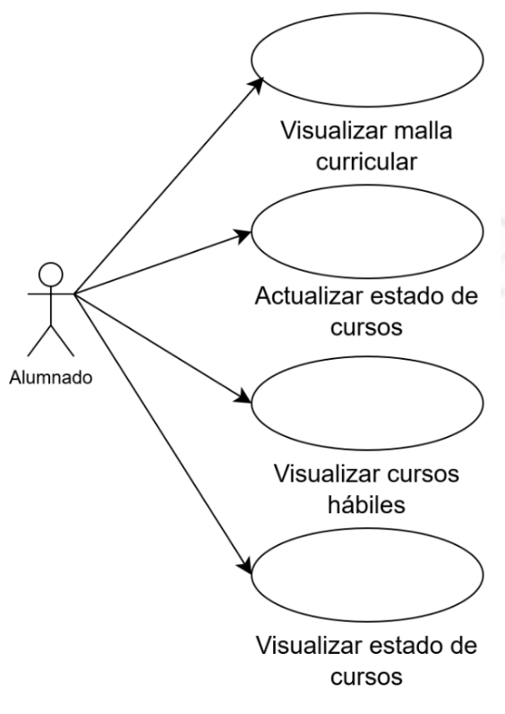
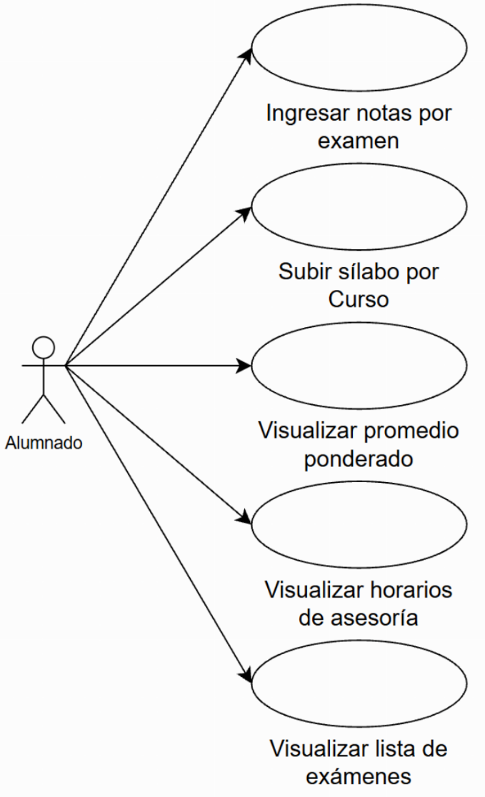
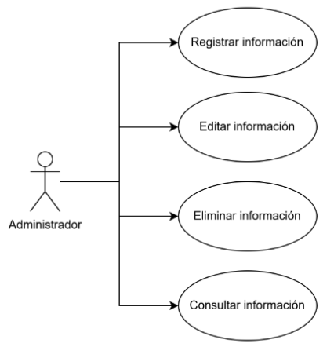
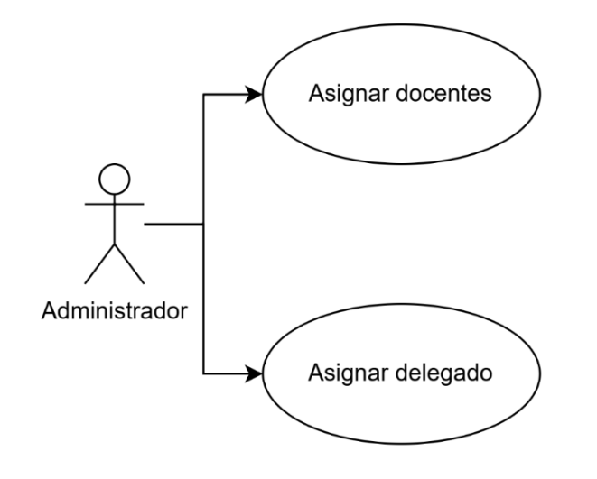
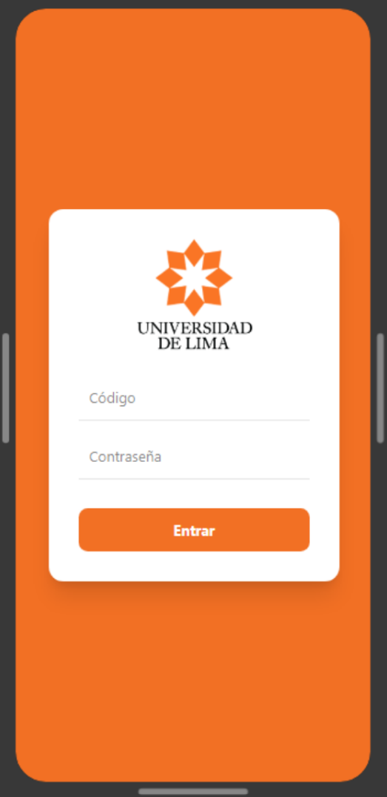
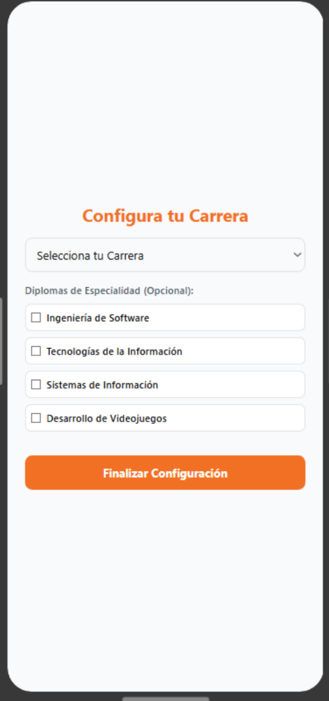
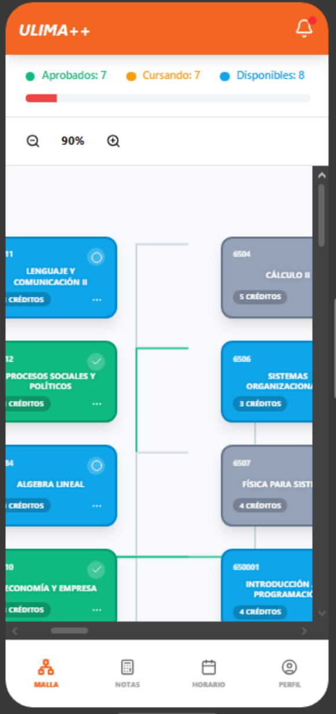
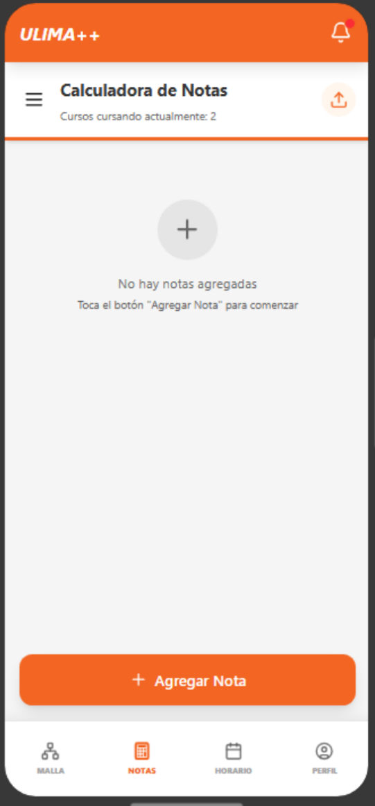
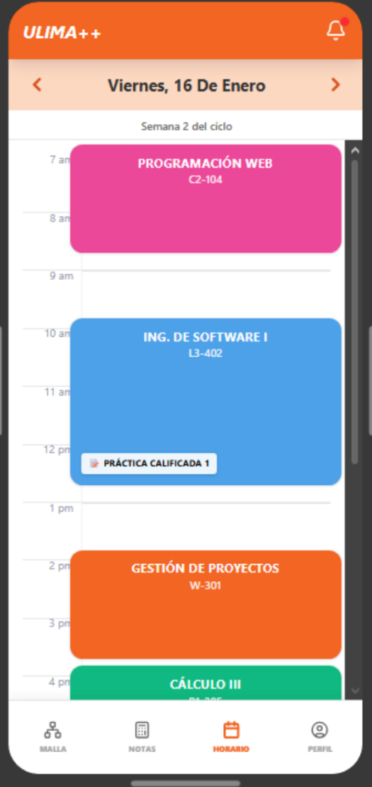
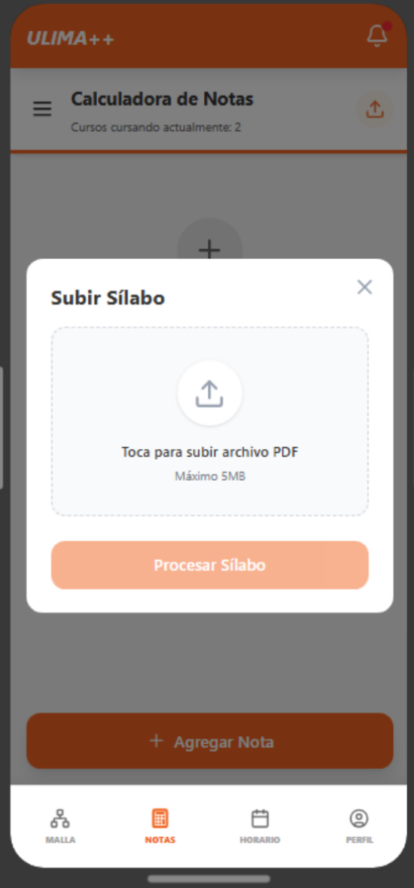

# ULima ++
App móvil diseñada para estudiantes de la Universidad de Lima que facilita la gestión académica en un solo lugar.

---

## Tabla de Contenidos
* [Descripcion del entorno de desarrollo](#-descripcion-del-entorno-de-desarrollo)
* [Requerimientos Funcionales](#-requerimientos-funcionales)
* [Diagramas de Casos de Uso](#-diagramas-de-casos-de-uso)
* [Requerimientos No Funcionales](#-requerimientos-no-funcionales)
* [Diagrama de Despliegue](#-diagrama-de-despliegue)
* [Mockups](#-mockups)

---

## Descripcion del entorno de desarrollo
> Esta sección detalla las herramientas y tecnologías configuradas para el diseño y construcción del proyecto.

### Diseño y Prototipado
Para garantizar una experiencia de usuario (UX) coherente y una identidad visual sólida, se utilizaron:

* **Figma:** Utilizado para el diseño de interfaces (UI), prototipado de alta fidelidad y definición del sistema de diseño (colores, tipografía y componentes).
* **Inkscape:** Herramienta de vectores utilizada específicamente para el diseño de logotipos e iconografía personalizada del proyecto, exportando assets en formato `.svg`.
---

### Stack de Desarrollo Mobile
El entorno está optimizado para el desarrollo multiplataforma buscando eficiencia en el rendimiento nativo.

| Herramienta | Función | Versión Sugerida |
| :--- | :--- | :--- |
| **Flutter SDK** | Framework principal de desarrollo UI | `^3.x.x` (Stable) |
| **Android Studio** | IDE principal y gestión de emuladores | `Ladybug` o superior |
| **Dart** | Lenguaje de programación | `^3.x.x` |

#### Configuración del IDE
Para replicar el entorno en **Android Studio**, se debe de tener instalados los siguientes plugins:
1. `Flutter` (oficial de dev.dart).
2. `Dart` (soporte de lenguaje).

## Requerimientos Funcionales

## Diagramas de Casos de Uso por Paquete

### Autenticación y Seguridad

---

### Gestión del Perfil Académico

---

### Gestión de Malla Curricular

---

### Seguimiento Académico

---

### Análisis de Riesgo Académico

---

### Gestión de Sección

---

### Administrador

---

### Estructura de Secciones

## Requerimientos No Funcionales
| Item | Requerimiento |
| :--- | :--- |
| **1** |El sistema deberá estar disponible el 99% del tiempo, las 24 horas del día, los 7 días de la semana. |
| **2** |El sistema deberá garantizar la seguridad y confidencialidad de los datos personales del usuario. |
| **3** |El sistema deberá responder a las acciones del usuario en un tiempo menor a 2 segundos en condiciones normales de operación. |
| **4** |El sistema deberá mantener la información persistente entre sesiones. |
| **5** |El sistema deberá cumplir con las políticas institucionales de protección de datos personales y la normativa vigente de privacidad. |
| **6** |El sistema deberá asegurar que el acceso a la información académica esté restringido según el rol del usuario (estudiante, delegado, subdelegado, soporte, administrador). |
| **7** |El sistema deberá proteger las credenciales del usuario mediante mecanismos de autenticación seguros. |
| **8** |El sistema deberá garantizar la integridad de los datos académicos durante los procesos de cálculo y simulación. |
| **9** |El sistema deberá contar con un servicio de soporte técnico activo, disponible al menos en horario laboral, con un tiempo de respuesta inicial no mayor a 24 horas. |
| **10** |El sistema deberá ser accesible desde dispositivos móviles con sistema operativo Android. |
| **11** |El sistema deberá ser intuitivo y fácil de usar, permitiendo que los nuevos usuarios aprendan a utilizar sus funcionalidades principales en un tiempo menor a 20 minutos. |
| **12** |El sistema deberá soportar el acceso concurrente de múltiples usuarios sin degradar significativamente su rendimiento. |
| **13** |El sistema deberá mantener un desempeño estable durante periodos de alta demanda académica, como matrículas y semanas de evaluaciones. |
| **14** |El sistema deberá presentar una interfaz coherente y consistente con los lineamientos de diseño institucional de la universidad. |
| **15** |El sistema deberá permitir futuras extensiones a otras plataformas móviles sin requerir un rediseño significativo de su arquitectura principal. |

## Diagrama de Despliegue

## Mockups
## Registro e Inicio de Sesión

| Inicio de Sesión | Configuración de carrera |
| :---: | :---: |
|  | 

---

## Control Académico e Interacción

| Malla Curricular | Calculadora de Notas | Horario Académico |
| :---: | :---: | :---: |
|  |  |  |

---

## Detalles y Notificaciones

| Gestión de Sílabo | Visualización por Curso | Buzón de Alertas |
| :---: | :---: | :---: |
|  |  |  |

### Módulo Delegado
El actor "Delegado" tendrá agregado su propio módulo donde se presentan las siguientes pantallas:

#### Pantalla de Gestión de Cursos - Delegado

#### Pantalla de Gestion de Anuncios - Delegado
#### Pantalla de Seguimiento de Progreso de Sección - Delegado

<!-- A partir de aqui es lo del ADMIN, q creo q ya no va(???) - preguntar a kingtana -->
### Pantallas del Administrador
#### Pantalla de Gestión de Información - Administrador
#### Pantalla de Nuevo/Editar registro de Carrera - Administrador
#### Pantalla de Nuevo/Editar Registro de Malla - Administrador

