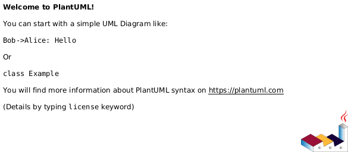

# ULima ++
App móvil diseñada para estudiantes de la Universidad de Lima que facilita la gestión académica en un solo lugar.

---

## Tabla de Contenidos
* [Descripcion del entorno de desarrollo](#descripcion-del-entorno-de-desarrollo)
* [Requerimientos Funcionales](#requerimientos-funcionales)
* [Diagramas de Casos de Uso](#diagramas-de-casos-de-uso)
* [Requerimientos No Funcionales](#requerimientos-no-funcionales)
* [Diagrama de Despliegue](#diagrama-de-despliegue)
* [Mockups](#mockups)

---

## Descripcion del entorno de desarrollo
> Esta sección detalla las herramientas y tecnologías configuradas para el diseño y construcción del proyecto.

### Diseño y Prototipado
Para garantizar una experiencia de usuario (UX) coherente y una identidad visual sólida, se utilizaron:

* **Figma:** Utilizado para el diseño de interfaces (UI), prototipado de alta fidelidad y definición del sistema de diseño (colores, tipografía y componentes).
* **Inkscape:** Herramienta de vectores utilizada específicamente para el diseño de logotipos e iconografía personalizada del proyecto, exportando assets en formato `.svg`.
---

### Stack de Desarrollo Mobile
El entorno está optimizado para el desarrollo multiplataforma buscando eficiencia en el rendimiento nativo.

| Herramienta | Función | Versión Sugerida |
| :--- | :--- | :--- |
| **Flutter SDK** | Framework principal de desarrollo UI | `3.41.6` (Stable) |
| **Android Studio** | IDE principal y gestión de emuladores | `Otter 2 Feature Drop` |
| **Dart** | Lenguaje de programación | `3.11.4` |

#### Configuración del IDE
Para replicar el entorno en **Android Studio**, se debe de tener instalados los siguientes plugins:
1. `Flutter` (oficial de dev.dart).
2. `Dart` (soporte de lenguaje).

## Requerimientos Funcionales

## Diagramas de Casos de Uso
<!--falta relacionar a los req funcionales-->

### Autenticación y Seguridad

### Gestión del Perfil Académico

### Gestión de Malla Curricular

---

### Seguimiento Académico

---

### Análisis de Riesgo Académico

---

### Gestión de Sección

## Requerimientos No Funcionales
| Item | Requerimiento |
| :--- | :--- |
| **1** |El sistema deberá estar disponible el 99% del tiempo, las 24 horas del día, los 7 días de la semana. |
| **2** |El sistema deberá garantizar la seguridad y confidencialidad de los datos personales del usuario. |
| **3** |El sistema deberá responder a las acciones del usuario en un tiempo menor a 2 segundos en condiciones normales de operación. |
| **4** |El sistema deberá mantener la información persistente entre sesiones. |
| **5** |El sistema deberá cumplir con las políticas institucionales de protección de datos personales y la normativa vigente de privacidad. |
| **6** |El sistema deberá asegurar que el acceso a la información académica esté restringido según el rol del usuario (estudiante, delegado, subdelegado, soporte, administrador). |
| **7** |El sistema deberá proteger las credenciales del usuario mediante mecanismos de autenticación seguros. |
| **8** |El sistema deberá garantizar la integridad de los datos académicos durante los procesos de cálculo y simulación. |
| **9** |El sistema deberá contar con un servicio de soporte técnico activo, disponible al menos en horario laboral, con un tiempo de respuesta inicial no mayor a 24 horas. |
| **10** |El sistema deberá ser accesible desde dispositivos móviles con sistema operativo Android. |
| **11** |El sistema deberá ser intuitivo y fácil de usar, permitiendo que los nuevos usuarios aprendan a utilizar sus funcionalidades principales en un tiempo menor a 20 minutos. |
| **12** |El sistema deberá soportar el acceso concurrente de múltiples usuarios sin degradar significativamente su rendimiento. |
| **13** |El sistema deberá mantener un desempeño estable durante periodos de alta demanda académica, como matrículas y semanas de evaluaciones. |
| **14** |El sistema deberá presentar una interfaz coherente y consistente con los lineamientos de diseño institucional de la universidad. |
| **15** |El sistema deberá permitir futuras extensiones a otras plataformas móviles sin requerir un rediseño significativo de su arquitectura principal. |

## Diagrama de Despliegue

### Descripción General

El diagrama de despliegue de **ULima++** representa la arquitectura del sistema en producción, mostrando cómo interactúan los diferentes componentes desde el dispositivo móvil del usuario hasta los servidores backend.

### Arquitectura del Sistema

La arquitectura implementa un modelo de **cliente-servidor distribuido** con separación clara de responsabilidades:

**Capa de Presentación (Cliente):**
- Aplicación móvil nativa desarrollada en **Flutter** para dispositivos Android
- Comunicación segura con el backend mediante protocolo **HTTPS/JSON**

**Servicio de Autenticación (Externo e Independiente):**
- **Autenticación centralizada** (OAuth 2.0 / JWT) separada del backend principal
- Gestiona credenciales institucionales y genera tokens de sesión
- Control de roles: estudiante, delegado, subdelegado, soporte, administrador
- Garantiza **disponibilidad independiente** del API principal (Req #1: 99%)
- Puede integrarse con sistemas institucionales (LDAP, Shibboleth)

**Capa de Aplicación (Servidor Backend):**
- **Load Balancer/Reverse Proxy**: Distribuye las solicitudes entre múltiples instancias del API para garantizar disponibilidad 99% y manejar acceso concurrente
- **API REST (Ruby Sinatra)**: Punto central de acceso a datos. Es el único componente que accede a la base de datos, implementando el patrón *single source of truth*
- **Servicio de Notificaciones**: Genera y envía alertas académicas a los usuarios

**Capa de Datos y Almacenamiento:**
- **Cache (Redis)**: Almacenamiento en memoria para datos frecuentemente consultados, optimizando respuestas a menos de 2 segundos
- **MySQL**: Base de datos relacional principal para persistencia de datos académicos
- **Almacenamiento de Archivos**: Sistema para gestión de sílabos y documentos académicos

### Flujo de Comunicación

1. La app móvil envía credenciales al Servicio de Autenticación externo
2. El servicio de autenticación valida y genera un token JWT
3. La app móvil envía solicitudes autenticadas al Load Balancer (con el token)
4. El Load Balancer distribuye las peticiones al API REST
5. El API valida el token y consulta el caché si es necesario
6. Para datos no en caché, el API accede a MySQL
7. El API emite alertas a través del Servicio de Notificaciones
8. Las respuestas retornan al cliente en formato JSON

### Principios de Diseño

- **Desacoplamiento**: Los servicios se comunican a través del API, no directamente a la BD
- **Escalabilidad**: Fácil agregar nuevas instancias del API o servicios sin modificar la estructura existente
- **Seguridad**: Punto único de control de acceso a datos sensibles + Autenticación independiente
- **Rendimiento**: Caché distribuido reduce latencia y carga en la BD
- **Disponibilidad**: Load Balancer garantiza redundancia y tolerancia a fallos; Servicio de Autenticación independiente asegura continuidad
- **Tolerancia a fallos**: Servicio de autenticación externo no depende del API principal

> **Especificación técnica:** [`diagrama_despliegue.puml`](assets/arquitectura/diagrama_despliegue.puml)

### Componentes

- **Servicio de Autenticación (Externo)**: Gestión centralizada de identidad y tokens (OAuth 2.0 / JWT)
- **Load Balancer**: Balanceo de carga y disponibilidad
- **Servicio de Notificaciones**: Alertas y comunicación
- **Cache (Redis)**: Optimización de rendimiento
- **MySQL**: Persistencia de datos (acceso exclusivo a través del API)
- **Almacenamiento de Archivos**: Gestión de sílabos

### Decisiones Arquitectónicas

- **Patrón Single Source of Truth**: Solo el API accede a MySQL, garantizando consistencia de datos
- **Servicio de Autenticación Externo**: Separado del backend para garantizar disponibilidad 99%, independencia de fallos y escalabilidad (Req #1, #6, #7)
- **Separación de responsabilidades**: Cada servicio tiene una función específica y bien definida
- **Tecnologías seleccionadas**: Ruby Sinatra por su simpleza y eficiencia, MySQL por confiabilidad, Redis para caché distribuido, OAuth 2.0/JWT para autenticación segura

## Mockups

> Esta sección presenta la propuesta de diseño de la interfaz de usuario (IU) para **ULima++**, basada en el prototipo desarrollado en Figma.
>
> Video demostratrivo: https://drive.google.com/file/d/1Ud0QhYXlN042FXot4d3tmKxhiTqTsK9D/view?usp=sharing

## Registro e Inicio de Sesión

| Inicio de Sesión | Configuración de carrera |
| :---: | :---: |
|  | 

---

## Control Académico e Interacción

| Malla Curricular | Calculadora de Notas | Horario Académico |
| :---: | :---: | :---: |
|  |  |  |

---

## Calculadora de Notas

| Gestión de Sílabo | Agregar Nota | Visualización de Notas |
| :---: | :---: | :---: |
|  |  |  |

## Detalles de Curso

| Anuncios | Asesorias | Contactos |
| :---: | :---: | :---: |
|  |  |  | 

## Perfil y Notificaciones

| Perfil | Buzón de Alertas |
| :---: | :---: |
|  |  |

### Módulo Delegado
El actor 'Delegado' contará con un módulo exclusivo que integra las siguientes interfaces:

| Gestión de Cursos | Gestion de Anuncios | Seguimiento de Progreso de Sección |
| :---: | :---: | :---: |
|  |  |  |

